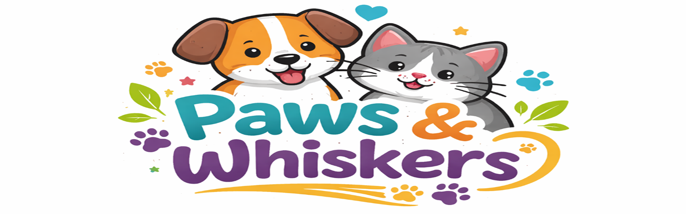
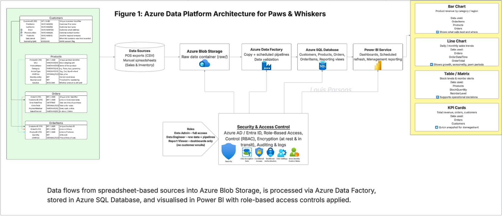

# Paws and Whiskers — Data & Cloud Proposal (Workbook Task)

## Overview



This repository contains a written proposal produced as part of a structured **bootcamp workbook task**.  
The task focused on assessing understanding of **data management, cloud concepts, security, governance, and professional communication**, rather than coding or technical implementation.

The submission takes the form of a single, extensive Word document, reflecting how similar work is commonly delivered in real organisations.

**Primary artefact:**
- `Paws and Whiskers.docx`

---

## Task Context & Expectations

The workbook task presented a fictional business scenario (*Paws and Whiskers*) and required learners to:

- Interpret business requirements from a written brief  
- Propose an appropriate data and/or cloud-based solution  
- Demonstrate understanding of:
  - Data storage and access
  - Security and compliance considerations
  - Governance and accountability
  - Risks and mitigations
- Communicate technical ideas clearly in written form

The task explicitly prioritised **reasoned explanation and clarity** over technical depth or tooling.

---

## Approach Taken

My approach was to treat the task as a **professional business proposal**, rather than a short-form workbook response.

Key decisions included:

- Expanding each required area into complete, structured sections
- Explaining *why* decisions were made, not just *what* they were
- Writing for both technical and non-technical audiences
- Maintaining a consistent tone and structure throughout the document

This resulted in a single cohesive document rather than a collection of disconnected answers.

---

## Document Structure

The document is structured to mirror how similar proposals are typically written in industry:

- Clear section headings aligned to the workbook requirements
- Logical progression from high-level context to more detailed considerations
- Separate discussion of data, security, governance, and risk
- Explicit explanations rather than assumed knowledge

This structure allows the document to be:
- Read linearly
- Skimmed by section
- Reviewed or assessed against task criteria

---

## Formatting Rationale

The formatting choices were intentional and task-driven:

- A Word document (`.docx`) was used as this is a common format for:
  - Proposals
  - Risk assessments
  - Governance documentation
- Consistent headings, spacing, and paragraph length were used to improve readability
- The presentation prioritises clarity and professionalism over visual design

This reflects how similar documentation is typically produced and reviewed in workplace settings.

---

## Scope and Limitations

- This project is **documentation-focused**
- No live systems, datasets, or cloud environments were implemented
- The emphasis is on:
  - Analytical thinking
  - Written communication
  - Understanding of concepts and trade-offs

This is intentional and aligned with the workbook assessment criteria.

---

## Repository Contents

```text
Paws-and-Whiskers/
│
├── Paws and Whiskers.docx    # Complete workbook task submission
├── README.md         # Project context and explanation
└── sources.md        # Reference material
